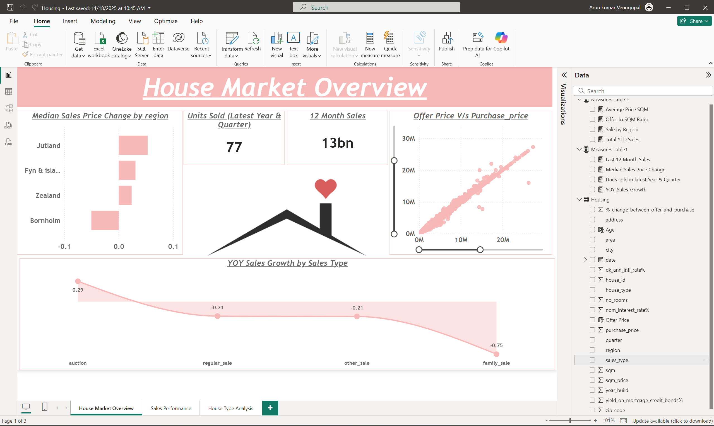
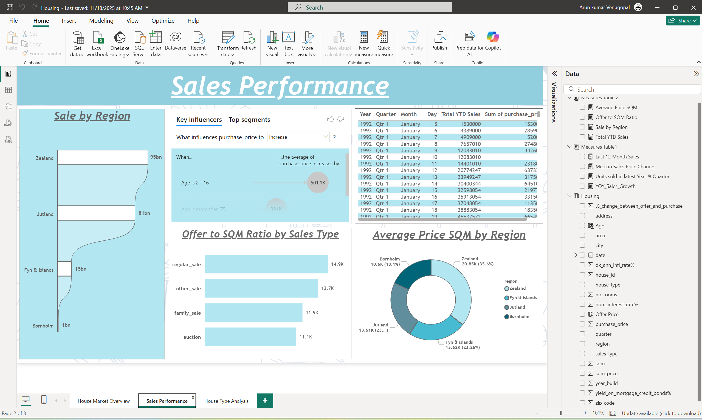
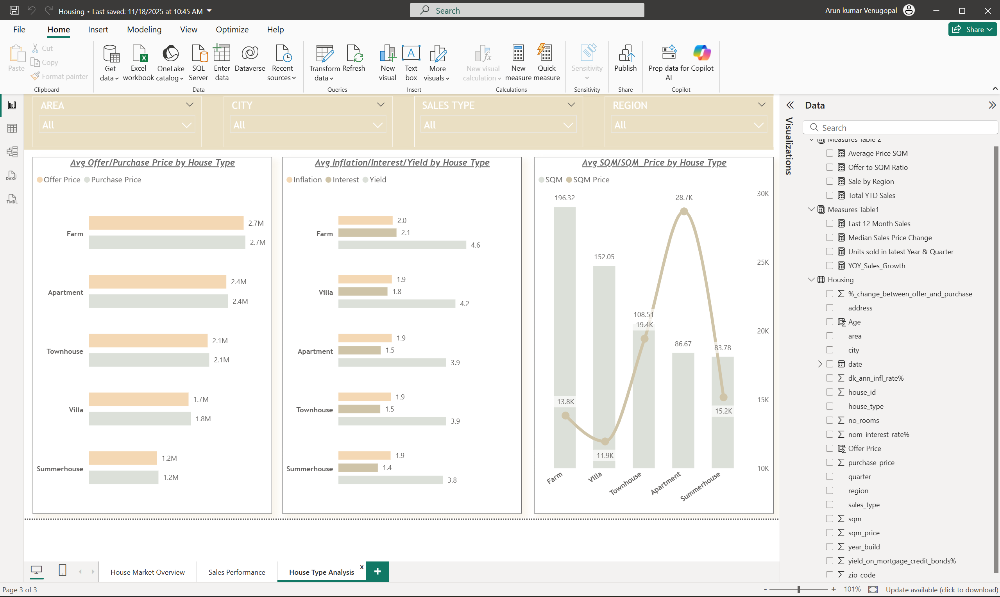

# Housing Market Analysis – End to End Power BI Project (Google BigQuery)

### 📂 GitHub Repository
https://github.com/Arun-Kumar-Venugopal/Housing-Market-Analysis-PowerBI-BigQuery

---

## Project Overview
This project delivers an end-to-end **housing market analytics solution** using **Google BigQuery as the cloud data source** and **Power BI for visualization**.

It demonstrates:
- Cloud data ingestion using BigQuery
- SQL-based data transformation
- Advanced DAX time intelligence
- Multi-page, interactive Power BI dashboards
- Deployment to Power BI Service

## Business Context
This dashboard enables **real estate analysts and investors** to understand housing market trends.
It provides insights into **sales growth, pricing behavior, regional performance, and property type analysis** to support data-driven investment and market strategy decisions.

---

## Architecture
Google BigQuery → Power BI Desktop → Power BI Service

---

## Data Source
- Platform: **Google BigQuery**
- Dataset: Housing
- Records: ~100,000
- Schema: Auto-detected

---

## Data Transformation

### BigQuery (SQL)
- Created test tables for analysis
- Applied conditional updates
- Aggregated sales metrics by sales type and region

### Power Query (Power BI)
- Column profiling on full dataset
- Null value handling and replacements
- Data type validation and cleanup

---

## Dashboard Pages

### Page 1 – House Market Overview
- Year-over-Year Sales Growth
- Median Sales Price Change by Region
- Units Sold (Latest Year & Quarter)
- Offer Price vs Purchase Price (Scatter Plot)

### Page 2 – Sales Performance
- Sales by Region
- Key Influencers analysis
- Offer to SQM Ratio by Sales Type
- Total YTD Sales (Table)

### Page 3 – House Type Analysis
- Avg Offer vs Purchase Price by House Type
- Inflation, Interest & Yield comparison
- SQM vs SQM Price analysis
- Interactive slicers for Area, City, Region & Sales Type

## 📐 Data Modeling & Calculations

### Calculated Columns
- Offer Price (derived using purchase price and offer variance)
- Property Age (calculated from build year and transaction date)

### DAX Measures
- Year-over-Year Sales Growth
- Median Sales Price Change
- Rolling 12-Month Sales
- Total YTD Sales
- Units Sold (Latest Year & Quarter)
- Offer to SQM Ratio

These calculations enable time intelligence, pricing comparisons,
and regional performance analysis.

---

## DAX Techniques Used
- `CALCULATE`, `TOTALYTD`
- `MEDIANX`, `DATESINPERIOD`
- Time intelligence (YOY, rolling 12 months)
- Advanced ratio and KPI calculations

---

## What I Learned
- Connecting Power BI with Google BigQuery
- Performing SQL transformations in cloud data warehouses
- Implementing advanced DAX time intelligence
- Designing multi-page analytical dashboards
- Publishing and managing reports in Power BI Service

---

## Live Demo (Power BI Service)
🔗 View-only report published to Power BI Service  
(Microsoft login required)

https://app.powerbi.com/links/cnatwzpkyx?ctid=4b05e781-4500-43c7-a12b-f7a45bcd4a54&pbi_source=linkShare

---

## Dashboard Screenshots

### House Market Overview

### Sales Performance

### House Type Analysis

---

## Author
**Arun Kumar Venugopal**  
Power BI | SQL | Cloud Analytics
